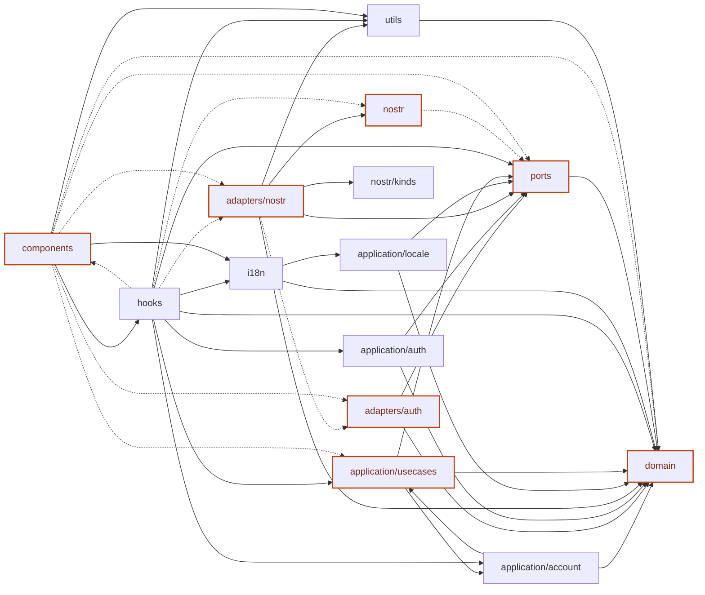

# TutorHub

Tutor Hub over Nostr: decentralized tutoring app where domain data lives in Nostr events.

## Current State (June 2026)

- Frontend MVP is active (`React + TypeScript + Vite`, PWA shell)
- Local dev relay built with [Khatru](https://github.com/fiatjaf/khatru) (Go) — in-memory, accepts all custom kinds
- **Roles are live** — every npub is bound to exactly one role (`tutor` / `student`). Stored in the local vault only — no Nostr channel carries the role. See `docs/plans/role_separation_tutor_student.md` for design notes.
- Lesson notes with visibility chips (`saved` / `published` / `shared`) — notes list and detail views accessible from lesson detail
- `App.tsx` is a thin shell/controller composition layer
- Frontend refactor is in progress to decouple business logic from raw Nostr event structures

## Implemented Features

- Mobile-first PWA layout with 4 tabs:
  - `Discover`
  - `Requests`
  - `Lessons`
  - `Profile`
- Tutor profile publishing (`kind 30000`, replaceable)
- Tutor schedule publishing (`kind 30001`, replaceable)
- Tutor discovery with subject filter and tutor detail view
- Booking requests (`kind 30002`) and booking statuses (`kind 30003`)
- Lesson agreements (`kind 30006`, addressable/replaceable by `d` tag)
- Lesson status updates (`scheduled` → `completed` / `cancelled`)
- Encrypted private messages (`kind 4`, NIP-04) in tutor/request/lesson detail flows
- Encrypted progress entries (`kind 30004`, NIP-04)
- **Lesson notes** — inline editor with Save / Publish / Share actions, notes list with visibility chips, note detail view
- Requests tab alert badge/highlight when new incoming request or message appears
- Relay configuration in Profile tab (persisted in localStorage)

## Roles

Every npub is bound to exactly one role (`tutor` or `student`), stored in the local vault. The role is never published to Nostr in MVP.

Role-aware UI behaviour:
- `Requests`: students see outgoing only (incoming segment is hidden)
- `Profile`: students have no ScheduleForm, no tutor metrics, no `subjects` / `hourlyRate` fields
- `Discover`: student chat is read+write; for tutors the chat area collapses
- `useTutorSchedule` and `bookingsState.incoming` are no-ops / empty for students
- `useAppNavigation` forces `requestSegment = "outgoing"` for students

Every new role-gated use-case calls `assertRole()` from `application/account/assertRole.ts` before side effects.

See `docs/plans/role_separation_tutor_student.md` and `docs/spec.md` §4 for details.

## Frontend Architecture

The frontend is moving toward a layered structure where Nostr is an implementation detail instead of the default shape of app logic.

- `frontend/src/domain/` — pure domain models (`Booking`, `Lesson`, `LessonNote`, etc.)
- `frontend/src/ports/` — repository interfaces (abstract contracts)
- `frontend/src/adapters/` — port implementations (localStorage, Web Crypto, Nostr)
- `frontend/src/application/` — use cases, auth, role guards
- `frontend/src/hooks/` — React orchestration hooks
- `frontend/src/components/` — presentation components and tab screens

Each layer directory has an agents-first README with key files and rules.



> Regenerate locally before pushing: `npm run depmap`

## Nostr Kinds Used

- `30000` Tutor Profile
- `30001` Tutor Schedule
- `30002` Booking Request
- `30003` Booking Status
- `30004` Student Progress Log / Lesson Note (encrypted, discriminated by JSON `type` field)
- `30005` Tutor Blog Post (reserved)
- `30006` Lesson Agreement
- `4` Private Direct Message (encrypted)

## Repository Structure

- `frontend/` — main app (React + TypeScript + Vite)
- `relay/` — local dev relay (Go + Khatru, in-memory store)
- `docs/` — specifications and event kind docs

## Development Setup

### Prerequisites

- **Node.js** >= 22
- **Go** >= 1.24
- **npm** >= 10

### Quick Start

From repository root:

```bash
# Install frontend dependencies
npm install

# Start both frontend and local relay
npm run dev
```

This starts:
- **Vite** dev server (frontend at `http://localhost:5173`)
- **Khatru** relay (Go) at `ws://localhost:5555`

The frontend automatically connects to `ws://localhost:5555` in development mode via `.env.development`.

### Environment

| Variable | Default | Description |
|----------|---------|-------------|
| `VITE_NOSTR_RELAYS` | `ws://localhost:5555` (dev) | Comma-separated relay URLs |
| `VITE_DEBUG_NOSTR` | — | Set to `true` to enable verbose Nostr event logging |

### Useful Scripts

```bash
npm run dev          # Frontend + relay (parallel)
npm run dev:client   # Frontend only
npm run dev:relay    # Relay only
npm run build        # Production build (frontend only)
npm run preview      # Preview production build
npm run test         # Run tests
npm run depmap       # Regenerate dependency diagram
```
