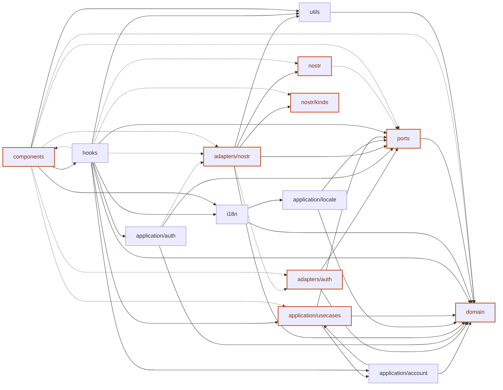

# TutorHub

Tutor Hub over Nostr: decentralized tutoring app where domain data lives in Nostr events.

## Current State (June 2026)

- Frontend MVP is active (`React + TypeScript + Vite`, PWA shell)
- **Clean Architecture** with Ports & Adapters — domain and application layers have zero framework/IO dependencies
- Local dev relay built with [Khatru](https://github.com/fiatjaf/khatru) (Go) — in-memory, accepts all custom kinds
- **Roles are live** — every npub is bound to exactly one role (`tutor` / `student`). Stored in the local vault only — no Nostr channel carries the role. See `docs/plans/role_separation_tutor_student.md` for design notes.
- Blog (`kind 30005`) is live — editor, drafts, post list, full CRUD
- Moderation (NIP-51 mute lists, NIP-56 reports), reviews (`kind 32267`), and computed reputation scores implemented
- Blossom media uploads (avatars, attachments), NIP-65 relay list metadata, cross-relay sync
- Optimistic UI updates for reviews and booking actions; contextual hints system
- i18n with EN, RU, UK translations (14 domains each)
- Multiple signer types: vault signer, NIP-07 (browser extension), NIP-46 (bunker), NIP-55 (Android native)
- Test suite: 40 test files across domain, application, and adapters (Vitest)

## Implemented Features

- Mobile-first PWA layout with 4 tabs:
  - `Discover`
  - `Requests`
  - `Lessons`
  - `Profile`
- Tutor profile publishing (`kind 0` / `kind 30000` deprecated)
- Tutor schedule publishing (`kind 30001`, replaceable)
- Tutor discovery with subject filter and tutor detail view
- Booking requests (`kind 30002`) and booking statuses (`kind 30003`)
- Lesson agreements (`kind 30006`, addressable/replaceable by `d` tag)
- Lesson status updates (`scheduled` → `completed` / `cancelled`)
- Encrypted private messages (`kind 4`, NIP-44 primary / NIP-04 legacy)
- Encrypted progress entries and lesson notes (`kind 30004`)
- **Lesson notes** — inline editor with Save / Publish / Share, notes list with visibility chips, note detail view
- Requests tab alert badge/highlight when new incoming request or message appears
- **Blog** — create, edit, publish, save drafts, view posts (kind 30005)
- **Moderation** — NIP-51 mute lists (publish/unmute, filter), NIP-56 reports
- **Reviews** — rate and review after a lesson (kind 32267), reputation scores
- **Blossom media** — avatar and attachment uploads with ImageViewer
- **NIP-65 relay list metadata** (kind 10002) — configurable relay list in settings
- **Cross-relay sync** via NIP-65 resolver — find profiles across relays
- **Optimistic UI** updates for reviews and booking accept/reject
- **Contextual hints** system (help popovers)
- **i18n** — English, Russian, Ukrainian (14 domains each)
- **Signer support** — vault, NIP-07, NIP-46, NIP-55
- **PWA** — service worker, manifest, icons, offline capability
- **Light/dark theme** toggle

## Roles

Every npub is bound to exactly one role (`tutor` or `student`), stored in the local vault. The role is never published to Nostr in MVP.

Role-aware UI behaviour:
- `Requests`: students see outgoing only (incoming segment is hidden)
- `Profile`: students have no ScheduleForm, no tutor metrics, no `subjects` / `hourlyRate` fields
- `Discover`: student chat is read+write; for tutors the chat area collapses
- `useTutorSchedule` and `bookingsState.incoming` are no-ops / empty for students
- `useAppNavigation` forces `requestSegment = "outgoing"` for students

Every new role-gated use-case calls `assertRole()` from `application/account/assertRole.ts` before side effects.

See `docs/plans/role_separation_tutor_student.md` and `docs/spec.md` §4 for details.

## Frontend Architecture

Clean Architecture with Ports & Adapters — Nostr is an implementation detail behind port interfaces.

- `frontend/src/domain/` — pure domain models (zero dependencies)
- `frontend/src/ports/` — repository interfaces (abstract contracts)
- `frontend/src/adapters/` — port implementations (localStorage, Web Crypto, Nostr, Blossom)
- `frontend/src/application/` — use cases (>25), auth, role guards
- `frontend/src/hooks/` — React orchestration hooks
- `frontend/src/components/` — presentation components and tab screens
- `frontend/src/nostr/` — transport utility (client wrapper, config, kinds); imported only by adapters
- `frontend/src/stores/` — Zustand stores (blog, booking, lesson, message, profile, review, schedule)
- `frontend/src/locales/` + `i18n/` — translation resources
- `frontend/src/theme/` — ThemeProvider (light/dark toggle)
- `frontend/src/utils/` — calendar, date/time, display, Nostr tags, notification helpers

Each layer directory has an agents-first README with key files and rules.



> Regenerate locally before pushing: `npm run depmap`

Dashed edges (`-.->`) indicate dependency violations that should be refactored.

## Nostr Kinds Used

- `0` — Metadata / Profile (primary; `30000` is `@deprecated`)
- `4` — Private Direct Message (encrypted, NIP-04 / NIP-44)
- `10000` — Mute List (NIP-51)
- `10002` — Relay List Metadata (NIP-65)
- `1984` — Report (NIP-56)
- `30000` — Tutor Profile (`@deprecated`, use kind 0)
- `30001` — Tutor Schedule
- `30002` — Booking Request
- `30003` — Booking Status
- `30004` — Student Progress Log / Lesson Note (encrypted, discriminated by JSON `type` field)
- `30005` — Tutor Blog Post
- `30006` — Lesson Agreement
- `32267` — Review (with rating)

## Repository Structure

- `frontend/` — main app (React + TypeScript + Vite)
- `relay/` — local dev relay (Go + Khatru, in-memory store, port 5555)
- `docs/` — specifications, event kind docs, diagrams, and 30+ implementation plans
- `scripts/` — utility scripts (dependency map generator)
- `.github/` — CI (build-only) and GitHub Pages deploy workflows

## Development Setup

### Prerequisites

- **Node.js** >= 22
- **Go** >= 1.24
- **npm** >= 10

### Quick Start

From repository root:

```bash
# Install frontend dependencies
npm install

# Start both frontend and local relay
npm run dev
```

This starts:
- **Vite** dev server (frontend at `http://localhost:5173`)
- **Khatru** relay (Go) at `ws://localhost:5555`

The frontend automatically connects to `ws://localhost:5555` in development mode via `.env.development`.

### Environment

| Variable | Default | Description |
|----------|---------|-------------|
| `VITE_NOSTR_RELAYS` | `ws://localhost:5555` (dev) | Comma-separated relay URLs |
| `VITE_DEBUG_NOSTR` | — | Set to `true` to enable verbose Nostr event logging |

### Useful Scripts

```bash
npm run dev          # Frontend + relay (parallel)
npm run dev:client   # Frontend only
npm run dev:relay    # Relay only
npm run build        # Production build (frontend only)
npm run preview      # Preview production build
npm run depmap       # Regenerate dependency diagram

# Tests run via frontend workspace:
npm --workspace frontend run test
# or: cd frontend && npm run test
```
